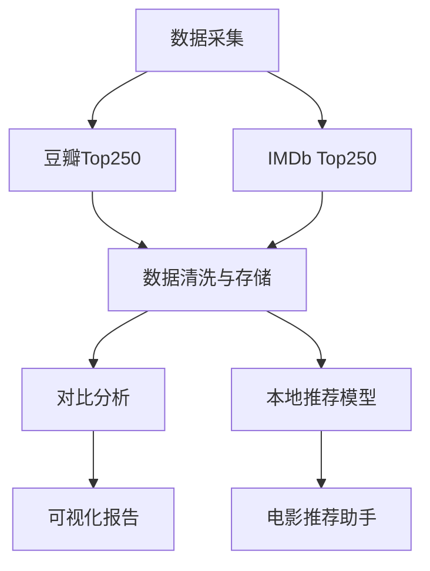

# 🎬 电影榜单分析与本地推荐系统

## 📌 项目概述

本项目通过Python爬虫获取豆瓣和IMDb电影Top250榜单数据，进行**跨文化视角的分析对比**，并部署本地大模型试着构建**隐私安全的离线电影推荐助手原型**。核心价值：

- 🔍 揭示中西方观众电影偏好差异
- 🤖 本地化部署保护用户隐私
- 🎯 提供个性化离线推荐服务

## ⚙️ 技术栈

| **数据采集** | `Selenium`自动化 |
| **数据处理** | `Pandas`清洗处理 |
| **分析可视化**| `Matplotlib` · `PyChart`基础绘图 |
| **本地部署** | `Ollama`管理本地模型 ·`Docker`容器化 · `RAGFlow`解析文档 · `Python API`调用 

